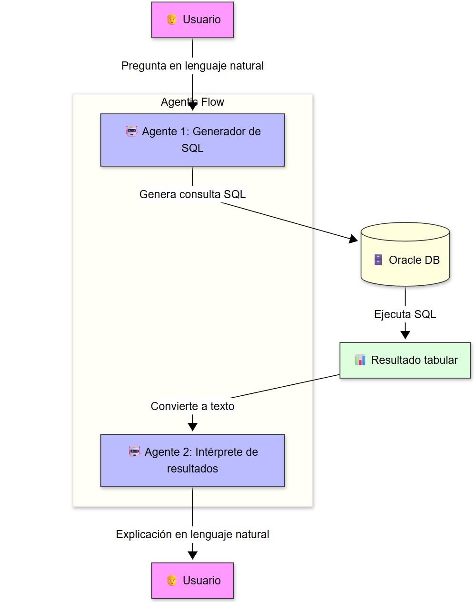

# 🧠 DBV-AgenticEduSQL

Este proyecto es una práctica educativa diseñada para enseñar cómo integrar modelos de lenguaje generativo (LLMs) con bases de datos Oracle. A través de dos enfoques distintos, los estudiantes aprenderán a generar y ejecutar consultas SQL a partir de lenguaje natural.

## 🎯 Objetivo

El objetivo principal es que los estudiantes de informática aprendan a:
- Conectarse a una base de datos Oracle desde Python.
- Formular preguntas en lenguaje natural sobre los datos.
- Usar un modelo de IA (como Gemini, GPT de OpenAI, etc.) para traducir esas preguntas a código SQL.
- Ejecutar las consultas de forma segura y obtener los resultados.
- Comprender las diferencias entre usar una librería nativa y un framework de abstracción multi-proveedor.



Este diagrama muestra el flujo completo del sistema de agentes que conecta la inteligencia artificial con la Base de Datos Oracle  para procesar consultas en lenguaje natural.

## 🚀 Dos Versiones para un Mismo Objetivo

Para facilitar el aprendizaje y mostrar diferentes arquitecturas de software, el proyecto se presenta en dos cuadernos de Jupyter distintos:

### 1. `oracle_agentic_gemini_hello_world.ipynb` (Enfoque Directo y Simple)

Esta versión utiliza la librería oficial de Google (`google-generativeai`) y se autentica con una **API Key de Gemini**. 

- **Ventaja Principal**: Es la forma más rápida y sencilla de empezar. Solo necesitas una API Key, lo que permite centrarse en la lógica de la aplicación sin configuraciones complejas.
- **Ideal para**: Proyectos de aprendizaje o prototipos que dependen de un único proveedor de IA.

### 2. `oracle_agentic_hello_world.ipynb` (Enfoque Flexible y Multi-Proveedor)

Esta versión utiliza la librería `AISuite`, un framework de abstracción que permite cambiar fácilmente entre diferentes proveedores de IA **(OpenAI, Google, Anthropic, etc.)** con solo cambiar una línea de configuración.

- **Ventaja Principal**: Su **flexibilidad**. Permite experimentar y comparar el rendimiento de distintos modelos (ej. `openai:gpt-4o`, `google:gemini-pro`, `anthropic:claude-3-sonnet`) sin reescribir el código. Es una arquitectura más robusta y adaptable.
- **Ideal para**: Proyectos que pueden necesitar cambiar de proveedor de IA en el futuro o que buscan encontrar el mejor modelo para una tarea específica.

## 🤔 ¿Qué enfoque elegir? Librería Nativa vs. Framework de Abstracción

La elección depende de tus objetivos. Para esta práctica, puedes empezar por el que prefieras, pero es útil entender sus diferencias conceptuales.

| Característica | Enfoque Directo (Librería Nativa) | Enfoque con Framework de Abstracción (AISuite) |
| :--- | :--- | :--- |
| **Proveedor de IA** | Específico de un proveedor (ej. Google Gemini). | **Multi-proveedor** (OpenAI, Google, Anthropic, etc.). |
| **Flexibilidad** | Baja. Cambiar de proveedor requiere reescribir código. | **Alta**. Cambiar de proveedor se hace con configuración. |
| **Facilidad de Uso** | Muy alta para el proveedor específico. | Alta, pero con una capa de abstracción que hay que aprender. |
| **Caso de Uso Ideal**| Proyectos que estandarizan un solo proveedor de IA. | Proyectos que necesitan flexibilidad para cambiar o comparar modelos. |
| **Dependencias** | Mínimas (solo la librería del proveedor). | Añade una dependencia extra (el framework `AISuite`). |


## 🧰 Requisitos

- Python 3.8+
- Acceso a una base de datos Oracle.
- Claves API del proveedor de IA que desees utilizar (OpenAI, Google, etc.).
- Jupyter Notebook.

## 📦 Instalación

1.  Clona el repositorio.
2.  Crea y activa un entorno virtual:
    ```bash
    python -m venv .venv
    # En Windows: .venv\Scripts\activate
    # En macOS/Linux: source .venv/bin/activate
    ```
3.  Instala las dependencias:
    ```bash
    pip install -r requirements.txt
    ```
4.  Crea un archivo `.env` a partir de `.env.sample` y añade tus credenciales de Oracle y las API Keys que vayas a usar (ej. `OPENAI_API_KEY`, `GOOGLE_API_KEY`).

## 🚀 Cómo Usar

1.  Ejecuta el script `basedatos.sql` en tu base de datos Oracle para crear las tablas y los datos de ejemplo.
2.  Abre el cuaderno de Jupyter que prefieras.
3.  Sigue las instrucciones del cuaderno para conectar a Oracle, formular una pregunta, generar el SQL y ver el resultado.

## 🔐 Seguridad

Este proyecto usa `.env` para proteger credenciales. No compartas tu archivo `.env` ni subas claves API a repositorios públicos.

## 👨‍🏫 Autor

David Bueno Vallejo — Profesor universitario de informática, apasionado por la enseñanza práctica, la IA agentic y la innovación educativa.

## ✨ Agradecimientos Especiales

Un agradecimiento especial a las IAs que colaboraron en la creación y mejora de este proyecto: **Gemini de Google** y **Copilot de GitHub**. Su asistencia fue fundamental para la depuración de código, la generación de explicaciones y la elaboración de esta documentación.

## 📄 Licencia

Este proyecto está bajo licencia MIT. Puedes usarlo, modificarlo y compartirlo libremente con fines educativos o personales.

---

¡Esperamos que disfrutes esta práctica y que te inspire a seguir explorando el mundo de la IA agentic aplicada a bases de datos!